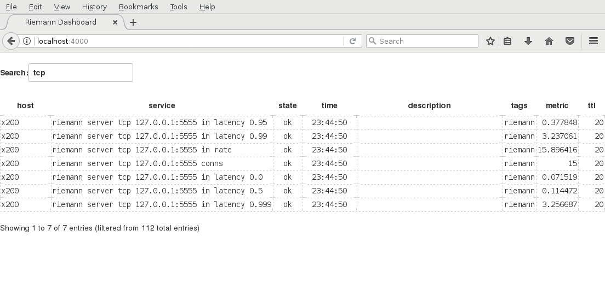

[](https://travis-ci.org/pdericson/riemann-dashboard)

# riemann-dashboard

Riemann Dashboard

Riemann Dashboard is a very basic dashboard that just shows a table of the Riemann index.



## Getting Started

You can run Riemann Dashboard in a container:

```
docker run -e LC_ALL=C.UTF-8 -e PORT=8000 -e RIEMANN_HOST=localhost -e RIEMANN_PORT=5555 -i --net host --rm -t debian:9.2 /bin/sh -c "\
apt-get update && \
apt-get install --no-install-recommends -y ca-certificates curl && \
curl -L https://github.com/pdericson/riemann-dashboard/releases/download/0.1.7/dashboard.tar.gz | tar xzf - -C /usr/local && \
dashboard foreground"
```

## Development

This command will prompt you to run `mix deps.get` and `cd assets && npm install` if needed:

```
iex -S mix phx.server
```
